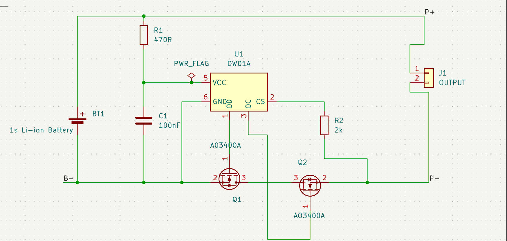
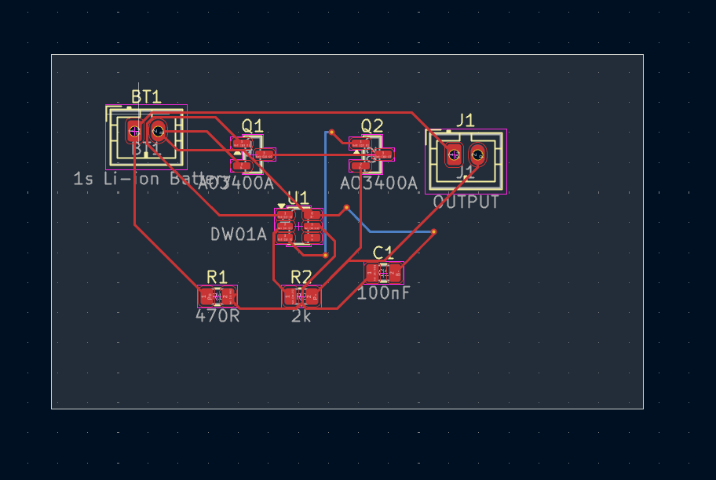
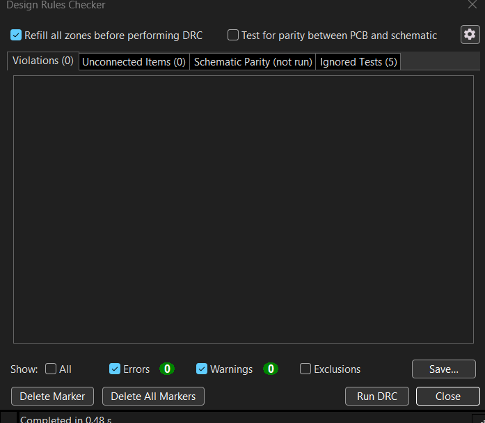

# 1S Li-ion Battery Protection PCB

A 2-layer PCB design for a 1S Li-ion battery protection circuit, developed using KiCad. The design uses the DW01A battery protection IC with two AO3400A N-channel MOSFETs arranged in a back-to-back configuration.

## Overview

The objective of this project is to design a compact PCB for protecting a single-cell Li-ion battery.

The circuit is designed to provide protection against:

- Overcharge
- Overdischarge
- Overcurrent and short-circuit conditions

The PCB includes the battery input, protection circuit, MOSFET switching stage, and protected output connector.

> **Project Status:** PCB design, routing, DRC validation, and Gerber generation have been completed in KiCad. Physical PCB fabrication and hardware testing have not yet been performed.

## Key Features

- 1S Li-ion battery protection
- DW01A battery protection IC
- Back-to-back AO3400A N-channel MOSFETs
- Low-side battery protection
- 2-layer PCB design
- Schematic capture using KiCad
- PCB layout and routing
- ERC/DRC validation
- 3D PCB visualization
- Gerber and drill file generation
- JST PH connectors

## Circuit Design

### Main Components

| Component | Value / Part | Purpose |
|---|---|---|
| U1 | DW01A | Li-ion battery protection controller |
| Q1 | AO3400A | Protection MOSFET |
| Q2 | AO3400A | Protection MOSFET |
| R1 | 470 Ω | VCC current limiting |
| R2 | 2 kΩ | Current-sense / CS interface |
| C1 | 100 nF | VCC filtering and decoupling |
| BT1 | 1S Li-ion Battery | Battery input |
| J1 | JST PH 2-pin | Protected output |

### Protection Topology

The two AO3400A MOSFETs are connected back-to-back in the battery negative path.

The DW01A controls the MOSFET gates through its:

- **OD** — Overdischarge control
- **OC** — Overcharge control
- **CS** — Current-sense / charger-detection input
- **VCC** — IC supply
- **GND** — IC ground

The back-to-back MOSFET configuration provides controlled switching of the battery negative path during normal and protection conditions.

## Schematic

The schematic was designed in KiCad using the DW01A protection IC, two AO3400A MOSFETs, resistors, capacitor, battery connector, and protected output connector.

## Schematic

## PCB Layout

## 3D View

[▶ Watch Full 3D PCB Demonstration](3d_view.mp4)

## PCB Validation

The PCB was checked using KiCad's Design Rules Checker (DRC).

- Violations: 0
- Unconnected items: 0

### Main Connections

- Battery positive is connected to the protected positive output.
- Battery negative enters the back-to-back MOSFET protection stage.
- DW01A VCC is supplied through R1.
- C1 provides VCC filtering between VCC and battery negative.
- The DW01A CS pin is connected through R2 to the protected negative path.
- DW01A OD and OC outputs control the two MOSFET gates.
- Q1 and Q2 form the back-to-back MOSFET arrangement.
- The protected output is provided through J1.

### Main Connections

- Battery positive is connected to the protected positive output.
- Battery negative enters the back-to-back MOSFET protection stage.
- DW01A VCC is supplied through R1.
- C1 provides VCC filtering between VCC and battery negative.
- The DW01A CS pin is connected through R2 to the protected negative path.
- DW01A OD and OC outputs control the two MOSFET gates.
- Q1 and Q2 form the back-to-back MOSFET arrangement.
- The protected output is provided through J1.

## PCB Design

The PCB was designed as a 2-layer board using KiCad.

### Design Considerations

- Compact component placement
- Wider traces for the main battery current path
- Separate routing for power and control signals
- SMD components for compact implementation
- Defined board outline using Edge.Cuts
- ERC and DRC validation before Gerber generation
- 3D visualization for layout inspection

## PCB Layout

The PCB contains the following major sections:

- Battery input section
- DW01A protection controller
- Back-to-back MOSFET switching stage
- Passive components
- Protected output connector

The main battery path uses wider PCB traces compared with the low-current control connections.

## PCB Validation

The completed PCB layout was checked using KiCad's Design Rules Checker (DRC).

### Validation Results

- **DRC Violations:** 0
- **Unconnected Items:** 0
- PCB routing completed
- 3D board visualization checked
- Gerber files generated
- Drill files generated

> DRC validation confirms PCB connectivity and design-rule compliance within KiCad. It does not replace physical electrical testing of the fabricated board.

## Gerber Files

Gerber and drill files were generated using KiCad's fabrication output tools.

The repository includes:

- Front Copper
- Back Copper
- Front Solder Mask
- Back Solder Mask
- Front Paste
- Back Paste
- Front Silkscreen
- Back Silkscreen
- Edge Cuts / Board Outline
- PTH Drill File
- NPTH Drill File
- Gerber Job File
- Gerber ZIP archive

These files can be used for future PCB fabrication.

## Tools Used

### PCB Design

- KiCad
- Schematic Capture
- PCB Layout
- PCB Routing
- ERC
- DRC
- 3D Viewer
- Gerber Generation

### Version Control

- Git
- GitHub
- Visual Studio Code

## Project Workflow

1. Define project requirements
2. Design the protection circuit
3. Create the schematic in KiCad
4. Select components and footprints
5. Create the PCB layout
6. Place components
7. Route PCB traces
8. Perform ERC and DRC checks
9. Inspect the board using the 3D Viewer
10. Generate Gerber and drill files

## Project Structure

The repository contains the KiCad project files, PCB design files, Gerber manufacturing files, drill files, and project documentation.

Main files include:

- `README.md`
- `.gitignore`
- `UniQ_1S_LiIon_Protection_PCB.kicad_pro`
- `UniQ_1S_LiIon_Protection_PCB.kicad_sch`
- `UniQ_1S_LiIon_Protection_PCB.kicad_pcb`
- Gerber files
- PTH and NPTH drill files
- Gerber ZIP archive

## Current Project Status

| Stage | Status |
|---|---|
| Schematic Design | Completed |
| PCB Layout | Completed |
| PCB Routing | Completed |
| ERC/DRC Validation | Completed |
| 3D Visualization | Completed |
| Gerber Generation | Completed |
| Drill File Generation | Completed |
| PCB Fabrication | Not yet performed |
| Hardware Testing | Not yet performed |

## Future Improvements

Possible future improvements include:

- Physical PCB fabrication
- Component assembly
- Electrical testing of the fabricated PCB
- Verification of protection behavior
- Battery voltage and current monitoring
- Addition of a dedicated fuel-gauge circuit
- PCB size optimization
- Thermal and current-capability evaluation
- Further design refinement based on hardware testing

## Limitations

- The PCB has not been physically fabricated yet.
- Hardware-level protection behavior has not been experimentally validated.
- No dedicated battery voltage/current monitoring circuit is implemented.
- Actual operating current capability depends on PCB copper, temperature, connectors, MOSFET conditions, and other hardware factors.
- Protection characteristics depend on the specific DW01A variant and final assembled circuit.

## Safety Note

This project is currently a PCB design project and has not been physically tested with a Li-ion battery.

Li-ion batteries can present significant safety risks if incorrectly charged, discharged, shorted, or connected to an improperly designed protection circuit.

Physical testing should only be performed after verifying the assembled hardware, component orientation, PCB connectivity, charger compatibility, and protection behavior using an appropriate controlled setup.

## Learning Outcomes

This project provided practical experience with:

- Schematic design
- PCB layout
- Component selection
- Battery protection circuit architecture
- MOSFET-based power switching
- KiCad PCB design workflow
- PCB routing
- ERC and DRC validation
- Gerber generation
- Drill file generation
- 3D PCB visualization
- Git and GitHub version control

## Future Hardware Implementation

The current design can serve as the basis for a future physical implementation.

The planned workflow would be:

1. PCB fabrication
2. Component procurement
3. PCB assembly
4. Visual inspection
5. Continuity and short-circuit checks
6. Controlled power-up
7. Protection testing
8. Hardware validation

## Author

**Praneeth N**

Electronics and Communication Engineering  
RV Institute of Technology and Management

GitHub: https://github.com/praneethn13

## Disclaimer

This repository represents an academic and portfolio PCB design project.

The PCB design has been completed and validated at the KiCad design level. Physical fabrication and hardware testing have not yet been performed.
